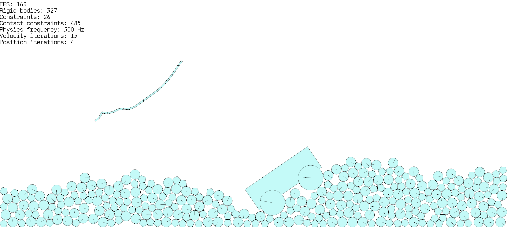

# Physics engine

A 2D physics engine based on sequential impulses. Featuring polygonal and circular rigid bodies, rigid and soft constraints, collision detection with an AABB tree, and collision resolution with warm starting for stability.

Current versions: 

- **SFML** 2.5.1
- **Visual Studio** 2022
